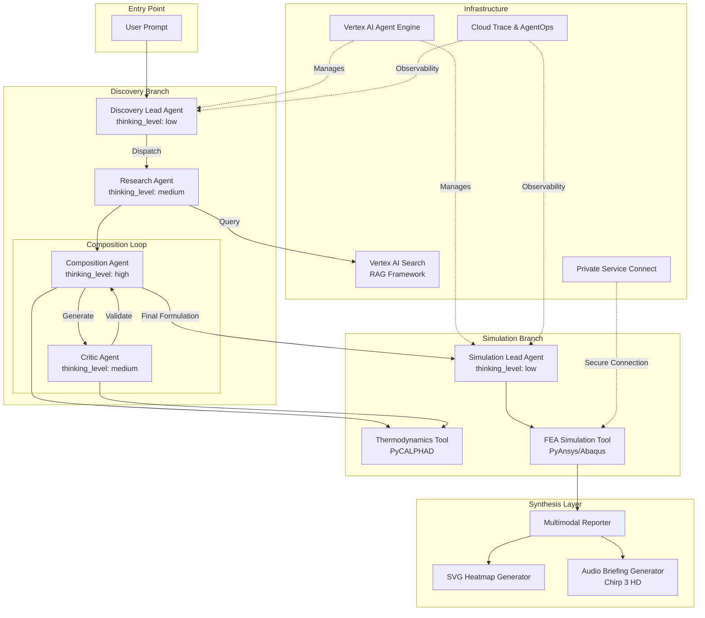
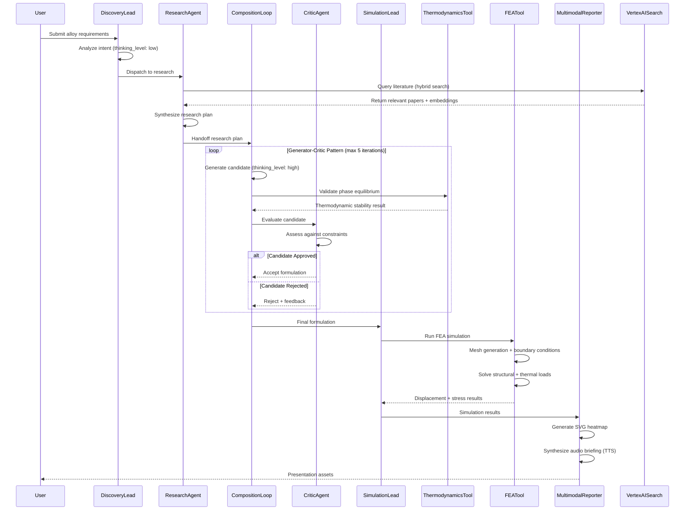

# Design Document: AeroForge Autonomous Multi-Agent Alloy Discovery System

## Overview

AeroForge is an end-to-end AI-driven materials design system that automates literature synthesis, alloy formulation, and high-fidelity virtual stress testing for aerospace applications. The system leverages Google's Agent Development Kit (ADK) to implement a hierarchical multi-agent architecture powered by Gemini 3.1 Pro, integrating empirical grounding via Vertex AI Search, physical simulation through PyCALPHAD and PyAnsys, and multimodal synthesis for presentation generation. The system orchestrates complex workflows using multiple design patterns (Coordinator/Dispatcher, Sequential Pipeline, Generator-Critic Loop, Parallel Fan-Out/Gather) while maintaining strict agent hierarchy rules and shared session state for inter-agent communication.

## Architecture

The system follows a hierarchical multi-agent architecture with two primary branches: Discovery Branch (literature research and alloy formulation) and Simulation Branch (thermodynamic validation and FEA testing). All agents communicate through a shared session state mechanism, ensuring data consistency and enabling complex orchestration patterns.



## Main Algorithm/Workflow



## Components and Interfaces

### Component 1: Discovery Lead Agent (Orchestrator)

**Purpose**: Entry point orchestrator that analyzes user intent and routes requests to specialized sub-agents using the Coordinator/Dispatcher pattern.

**Interface**:
```python
class DiscoveryLeadAgent(BaseAgent):
    def __init__(self):
        super().__init__(name="Discovery Lead", thinking_level="low")
    
    def dispatch(self, user_intent: str, session_state: dict) -> dict:
        """
        Analyzes user intent and routes to appropriate sub-agent.
        
        Args:
            user_intent: Natural language description of alloy requirements
            session_state: Shared state dictionary for inter-agent communication
            
        Returns:
            Updated session_state with routing information
        """
        pass
```

**Responsibilities**:
- Parse and classify user intent using Gemini 3.1 Pro (low thinking level for fast routing)
- Determine appropriate workflow path (research → composition → simulation)
- Initialize shared session state with user requirements
- Route to Research Agent for literature grounding

**Preconditions**:
- user_intent is non-empty string
- session_state is initialized dictionary

**Postconditions**:
- session_state contains "query_intent" and "next_agent" keys
- next_agent is set to "research"
- No modifications to user_intent parameter


### Component 2: Research Agent

**Purpose**: Implements Parallel Fan-Out/Gather pattern to query Vertex AI Search for relevant literature, synthesizing research findings into actionable constraints for alloy formulation.

**Interface**:
```python
class ResearchAgent(BaseAgent):
    def __init__(self):
        super().__init__(name="Research Agent", thinking_level="medium")
        
    def execute(self, session_state: dict) -> dict:
        """
        Queries Vertex AI Search and synthesizes research plan.
        
        Args:
            session_state: Contains query_intent from Discovery Lead
            
        Returns:
            Updated session_state with research_plan
        """
        pass
    
    def query_vertex_search(self, query: str) -> list[dict]:
        """
        Executes hybrid search (keyword + semantic) against Vertex AI Data Store.
        
        Args:
            query: Search query derived from user intent
            
        Returns:
            List of relevant documents with metadata and embeddings
        """
        pass
```

**Responsibilities**:
- Construct optimized search queries from user intent
- Execute hybrid search (keyword + vector embeddings) via Vertex AI Search API
- Parse OCR-extracted content from scientific PDFs (tables, formulas)
- Apply re-ranker for relevance scoring
- Synthesize research findings into structured research plan
- Extract required properties, suggested elements, and thermodynamic constraints

**Preconditions**:
- session_state contains valid "query_intent"
- Vertex AI Search data store is accessible and populated
- VERTEX_DATA_STORE_ID is configured

**Postconditions**:
- session_state contains "research_plan" with keys: required_properties, suggested_elements, thermodynamic_constraints
- next_agent is set to "composition_loop"
- Research plan is serializable (basic types only)


### Component 3: Composition Agent (Generator)

**Purpose**: Generates candidate alloy formulations using deep reasoning (high thinking level) based on research constraints and domain knowledge.

**Interface**:
```python
class CompositionAgent(BaseAgent):
    def __init__(self):
        super().__init__(name="Composition Agent", thinking_level="high")
        
    def generate(self, session_state: dict) -> dict:
        """
        Generates candidate alloy formulation using Gemini 3.1 Pro with high thinking level.
        
        Args:
            session_state: Contains research_plan with constraints
            
        Returns:
            Updated session_state with proposed_alloy
        """
        pass
```

**Responsibilities**:
- Analyze research plan constraints (required properties, suggested elements)
- Apply materials science domain knowledge via Gemini 3.1 Pro
- Generate candidate alloy composition (element matrix, target temperature)
- Consider phase diagrams, solubility limits, and processing constraints
- Utilize high thinking level for complex physics reasoning

**Preconditions**:
- session_state contains valid "research_plan"
- research_plan has suggested_elements list
- Gemini 3.1 Pro API is accessible

**Postconditions**:
- session_state contains "proposed_alloy" with keys: matrix (list of elements), target_temp_K (float)
- proposed_alloy is serializable
- Element symbols are valid chemical notation


### Component 4: Critic Agent (Evaluator)

**Purpose**: Evaluates candidate alloy formulations against thermodynamic constraints using PyCALPHAD, implementing the Critic role in the Generator-Critic pattern.

**Interface**:
```python
class CriticAgent(BaseAgent):
    def __init__(self):
        super().__init__(name="Critic Agent", thinking_level="medium")
        
    def evaluate(self, session_state: dict) -> bool:
        """
        Evaluates proposed alloy against thermodynamic rules.
        
        Args:
            session_state: Contains proposed_alloy from Composition Agent
            
        Returns:
            True if alloy passes validation, False otherwise
        """
        pass
```

**Responsibilities**:
- Extract proposed alloy from session state
- Invoke PyCALPHAD thermodynamics tool for phase equilibrium calculation
- Assess phase stability at target temperature
- Validate against thermodynamic constraints from research plan
- Provide feedback for rejected candidates
- Store validation results in session state

**Preconditions**:
- session_state contains valid "proposed_alloy"
- proposed_alloy has matrix and target_temp_K
- PyCALPHAD is installed and TDB database is accessible

**Postconditions**:
- session_state contains "thermo_validation" with stability assessment
- Returns boolean indicating pass/fail
- If failed, session_state may contain rejection feedback


### Component 5: Simulation Lead Agent (Orchestrator)

**Purpose**: Routes finalized alloy candidates to physical simulation tools (FEA) for structural and thermal validation.

**Interface**:
```python
class SimulationLeadAgent(BaseAgent):
    def __init__(self):
        super().__init__(name="Simulation Lead", thinking_level="low")
        
    def dispatch(self, formulation_data: dict, session_state: dict) -> dict:
        """
        Routes alloy candidate to FEA simulation pipeline.
        
        Args:
            formulation_data: Final alloy composition from Discovery Branch
            session_state: Shared state for simulation results
            
        Returns:
            Updated session_state with simulation_target
        """
        pass
```

**Responsibilities**:
- Receive finalized alloy formulation from Composition Loop
- Prepare simulation parameters (geometry, loads, boundary conditions)
- Route to FEA simulation tool
- Coordinate with PyAnsys/Abaqus via gRPC
- Store simulation results in session state

**Preconditions**:
- formulation_data contains valid alloy composition
- session_state is accessible
- FEA solver is available (local or remote via PSC)

**Postconditions**:
- session_state contains "simulation_target" with formulation
- Simulation pipeline is initiated
- No modifications to formulation_data


### Component 6: Thermodynamics Tool (PyCALPHAD Wrapper)

**Purpose**: Provides thermodynamic phase equilibrium calculations using the CALPHAD method and Gibbs energy minimization.

**Interface**:
```python
def calculate_phase_equilibrium(
    elements: list[str], 
    temperature: float, 
    pressure: float = 101325.0, 
    tdb_path: str = "mock.tdb"
) -> str:
    """
    Calculates thermodynamic phase equilibria using PyCALPHAD.
    
    Args:
        elements: List of element symbols (e.g., ["Ti", "Al", "V"])
        temperature: Target temperature in Kelvin
        pressure: Pressure in Pascals (default: 1 atm)
        tdb_path: Path to thermodynamic database file
        
    Returns:
        JSON string with stability assessment and phase fractions
    """
    pass
```

**Responsibilities**:
- Load thermodynamic database (TDB format)
- Configure PyCALPHAD equilibrium calculation
- Set conditions (temperature, pressure, composition)
- Execute Gibbs energy minimization
- Extract stable phases and phase fractions
- Return serialized results as JSON

**Preconditions**:
- elements list is non-empty with valid chemical symbols
- temperature is positive float
- tdb_path points to valid TDB database file
- PyCALPHAD is installed

**Postconditions**:
- Returns JSON string with keys: elements, temperature_K, pressure_Pa, stable_phases, is_stable
- stable_phases is list of {phase: str, fraction: float}
- is_stable is boolean indicating thermodynamic stability
- No side effects on input parameters


### Component 7: FEA Simulation Tool (PyAnsys Wrapper)

**Purpose**: Executes finite element analysis for structural and thermal validation using PyAnsys/Abaqus via gRPC.

**Interface**:
```python
def run_fea_analysis(
    mesh_geometry: str, 
    thermal_load: float, 
    structural_load: float
) -> str:
    """
    Runs FEA simulation on component digital twin.
    
    Args:
        mesh_geometry: Identifier for component geometry (e.g., "turbine_blade_v1")
        thermal_load: Thermal load in Kelvin
        structural_load: Structural load in Newtons
        
    Returns:
        JSON string with displacement, stress, and survival assessment
    """
    pass
```

**Responsibilities**:
- Connect to Ansys MAPDL instance via gRPC
- Load or generate component geometry mesh
- Define material properties from alloy composition
- Apply boundary conditions (fixed constraints, loads)
- Execute static structural analysis
- Extract maximum displacement and von Mises stress
- Assess component survival against failure criteria
- Return serialized results

**Preconditions**:
- mesh_geometry is valid identifier or geometry definition
- thermal_load and structural_load are positive floats
- Ansys MAPDL is accessible (local or via Private Service Connect)
- Material properties can be derived from alloy composition

**Postconditions**:
- Returns JSON string with keys: max_displacement_mm, von_mises_stress_MPa, thermal_gradient_K, survived, failure_mode
- survived is boolean indicating if component passed failure criteria
- failure_mode is string (or null) describing failure type
- MAPDL connection is properly closed


### Component 8: Multimodal Reporter

**Purpose**: Synthesizes simulation results into multimodal presentation assets (SVG heatmaps and audio briefings).

**Interface**:
```python
def finalize_presentation(
    session_state: dict, 
    output_dir: str = "./reports"
) -> tuple[str, str]:
    """
    Generates multimodal presentation from session state.
    
    Args:
        session_state: Complete workflow state with simulation results
        output_dir: Directory for output files
        
    Returns:
        Tuple of (svg_path, audio_path)
    """
    pass

def generate_svg_heatmap(
    simulation_results: dict, 
    output_path: str = "heatmap.svg"
) -> str:
    """
    Generates animated SVG heatmap using Gemini code generation.
    
    Args:
        simulation_results: FEA results with stress/displacement data
        output_path: Output file path
        
    Returns:
        Path to generated SVG file
    """
    pass

def generate_audio_briefing(
    session_state: dict, 
    output_path: str = "briefing.mp3"
) -> str:
    """
    Synthesizes audio briefing using Chirp 3 HD TTS.
    
    Args:
        session_state: Complete workflow state
        output_path: Output file path
        
    Returns:
        Path to generated audio file
    """
    pass
```

**Responsibilities**:
- Extract simulation results from session state
- Generate dynamic SVG heatmap with stress/displacement visualization
- Use Gemini 3.1 Pro for SVG code generation (layered iteration)
- Synthesize multi-speaker audio briefing via Chirp 3 HD TTS
- Apply MultiSpeakerVoiceConfig for narrator variety
- Save presentation assets to output directory

**Preconditions**:
- session_state contains "simulation_results" with FEA data
- output_dir is writable directory path
- Gemini TTS API is accessible

**Postconditions**:
- SVG file is created with valid SVG markup and animations
- Audio file (or transcript) is created
- Returns tuple of file paths
- Files are saved to output_dir


## Data Models

### SessionState

```python
SessionState = {
    "initial_prompt": str,           # Original user request
    "query_intent": str | None,      # Parsed intent from Discovery Lead
    "research_plan": ResearchPlan | None,  # Synthesized research findings
    "proposed_alloy": AlloyCandidate | None,  # Current candidate formulation
    "final_formulation": AlloyCandidate | None,  # Validated formulation
    "thermo_validation": ThermoResult | None,  # PyCALPHAD results
    "simulation_target": AlloyCandidate | None,  # Formulation for FEA
    "simulation_results": FEAResult | None,  # FEA output
    "next_agent": str,               # Routing information
    "loop_iterations": int           # Composition loop counter
}
```

**Validation Rules**:
- All values must be serializable (basic types, dicts, lists)
- initial_prompt is required and non-empty
- loop_iterations must be non-negative integer
- next_agent must be valid agent identifier

### ResearchPlan

```python
ResearchPlan = {
    "required_properties": list[str],  # e.g., ["high_tensile_strength", "oxidation_resistance"]
    "suggested_elements": list[str],   # e.g., ["Ti", "Al", "V"]
    "thermodynamic_constraints": str   # Natural language constraints
}
```

**Validation Rules**:
- required_properties is non-empty list
- suggested_elements contains valid chemical symbols
- thermodynamic_constraints is non-empty string

### AlloyCandidate

```python
AlloyCandidate = {
    "matrix": list[str],      # Element composition, e.g., ["Ti", "Al", "V"]
    "target_temp_K": float    # Target operating temperature in Kelvin
}
```

**Validation Rules**:
- matrix is non-empty list of valid element symbols
- target_temp_K is positive float (> 0)
- Element symbols follow standard chemical notation


### ThermoResult

```python
ThermoResult = {
    "elements": list[str],           # Input elements
    "temperature_K": float,          # Calculation temperature
    "pressure_Pa": float,            # Calculation pressure
    "stable_phases": list[Phase],    # List of stable phases
    "is_stable": bool                # Overall stability assessment
}

Phase = {
    "phase": str,      # Phase name (e.g., "FCC_A1", "BCC_A2")
    "fraction": float  # Phase fraction (0.0 to 1.0)
}
```

**Validation Rules**:
- elements matches input to PyCALPHAD
- temperature_K and pressure_Pa are positive floats
- stable_phases is list (may be empty)
- Each phase fraction is between 0.0 and 1.0
- Sum of phase fractions should be approximately 1.0

### FEAResult

```python
FEAResult = {
    "max_displacement_mm": float,      # Maximum displacement in millimeters
    "von_mises_stress_MPa": float,     # Maximum von Mises stress in MPa
    "thermal_gradient_K": float,       # Thermal gradient in Kelvin
    "survived": bool,                  # Component survival assessment
    "failure_mode": str | None         # Failure description if survived=False
}
```

**Validation Rules**:
- max_displacement_mm is non-negative float
- von_mises_stress_MPa is non-negative float
- thermal_gradient_K is non-negative float
- survived is boolean
- failure_mode is string if survived=False, None otherwise


## Algorithmic Pseudocode

### Main Pipeline Orchestration

```pascal
ALGORITHM execute_pipeline(user_prompt)
INPUT: user_prompt of type String
OUTPUT: session_state of type SessionState

PRECONDITIONS:
  - user_prompt is non-empty string
  - All agent instances are initialized
  - Infrastructure services (Vertex AI, PyCALPHAD, PyAnsys) are accessible

POSTCONDITIONS:
  - session_state contains complete workflow results
  - If successful: session_state.final_formulation is not null AND session_state.simulation_results is not null
  - If failed: appropriate error information is logged
  - All resources are properly released

BEGIN
  // Initialize shared session state
  session_state ← {
    initial_prompt: user_prompt,
    query_intent: null,
    research_plan: null,
    final_formulation: null,
    simulation_target: null,
    simulation_results: null,
    next_agent: "discovery_lead",
    loop_iterations: 0
  }
  
  // Initialize agent hierarchy
  discovery_lead ← new DiscoveryLeadAgent()
  research_agent ← new ResearchAgent()
  simulation_lead ← new SimulationLeadAgent()
  
  // Step 1: Coordinator/Dispatcher Pattern
  LOG("Step 1: Coordinator/Dispatcher")
  session_state ← discovery_lead.dispatch(user_prompt, session_state)
  ASSERT session_state.query_intent is not null
  ASSERT session_state.next_agent = "research"
  
  // Step 2: Parallel Fan-Out/Gather (RAG)
  LOG("Step 2: Grounding via Vertex AI Search")
  session_state ← research_agent.execute(session_state)
  ASSERT session_state.research_plan is not null
  ASSERT session_state.research_plan.suggested_elements is not empty
  
  // Step 3: Generator & Critic Loop Pattern
  LOG("Step 3: Loop Primitive (Composition & Validation)")
  TRY
    session_state ← run_composition_loop(session_state, max_iterations: 5)
    ASSERT session_state.final_formulation is not null
  CATCH exception
    LOG_ERROR("Formulation failed: " + exception.message)
    RETURN session_state
  END TRY
  
  // Step 4: Simulation Routing
  LOG("Step 4: Handoff to Simulation Pipeline")
  session_state ← simulation_lead.dispatch(session_state.final_formulation, session_state)
  ASSERT session_state.simulation_target is not null
  
  // Step 5: Deterministic Physics Validation
  LOG("Step 5: Deterministic Physics Validation (FEA)")
  fea_result_json ← run_fea_analysis(
    mesh_geometry: "high_pressure_turbine_blade_v1",
    thermal_load: 1500.0,
    structural_load: 650.0
  )
  fea_results ← parse_json(fea_result_json)
  session_state.simulation_results ← fea_results
  
  LOG("Final Validation: Survived = " + fea_results.survived)
  IF NOT fea_results.survived THEN
    LOG_WARNING("Component Failure: " + fea_results.failure_mode)
  END IF
  
  // Step 6: Multimodal Synthesis
  LOG("Step 6: Multimodal Synthesis Layer")
  (svg_path, audio_path) ← finalize_presentation(session_state)
  LOG("Generated Presentation Assets: " + svg_path + ", " + audio_path)
  
  LOG("Pipeline execution complete")
  RETURN session_state
END
```


### Composition Loop Algorithm (Generator-Critic Pattern)

```pascal
ALGORITHM run_composition_loop(session_state, max_iterations)
INPUT: session_state of type SessionState, max_iterations of type Integer
OUTPUT: session_state with final_formulation

PRECONDITIONS:
  - session_state.research_plan is not null
  - max_iterations is positive integer (typically 3-5)
  - Composition and Critic agents are initialized

POSTCONDITIONS:
  - session_state.final_formulation is not null (if successful)
  - session_state.loop_iterations ≤ max_iterations
  - If successful: final_formulation passed thermodynamic validation
  - If failed: raises ValueError with iteration count

LOOP INVARIANTS:
  - session_state.loop_iterations ≤ current iteration number
  - All previously rejected candidates failed thermodynamic validation
  - session_state remains in consistent state throughout iterations

BEGIN
  generator ← new CompositionAgent()
  critic ← new CriticAgent()
  
  FOR i FROM 1 TO max_iterations DO
    ASSERT session_state.loop_iterations = i - 1
    
    LOG("Loop Iteration " + i)
    session_state.loop_iterations ← i
    
    // Generator phase: Create candidate alloy
    session_state ← generator.generate(session_state)
    ASSERT session_state.proposed_alloy is not null
    ASSERT session_state.proposed_alloy.matrix is not empty
    
    // Critic phase: Validate candidate
    passed ← critic.evaluate(session_state)
    ASSERT session_state.thermo_validation is not null
    
    IF passed THEN
      LOG("Loop success: Candidate stabilized")
      session_state.final_formulation ← session_state.proposed_alloy
      ASSERT session_state.final_formulation is not null
      RETURN session_state
    END IF
    
    LOG("Loop failed: Critic rejected formulation. Iterating...")
    // Loop continues with next iteration
  END FOR
  
  // Max iterations reached without success
  RAISE ValueError("Failed to find stable alloy formulation after " + max_iterations + " iterations")
END
```


### Vertex AI Search Query Algorithm

```pascal
ALGORITHM query_vertex_search(query_intent)
INPUT: query_intent of type String
OUTPUT: research_results of type List[Document]

PRECONDITIONS:
  - query_intent is non-empty string
  - Vertex AI Search data store is initialized and populated
  - VERTEX_DATA_STORE_ID is configured in environment

POSTCONDITIONS:
  - Returns list of relevant documents (may be empty)
  - Each document contains: content, metadata, relevance_score
  - Documents are ranked by relevance (highest first)
  - No modifications to query_intent parameter

BEGIN
  // Initialize Vertex AI Search client
  client ← create_vertex_search_client(
    project_id: settings.PROJECT_ID,
    location: settings.LOCATION,
    data_store_id: settings.VERTEX_DATA_STORE_ID
  )
  
  // Construct hybrid search request
  search_request ← {
    query: query_intent,
    search_type: "HYBRID",  // Keyword + semantic vector search
    page_size: 10,
    enable_reranking: true,
    content_search_spec: {
      extract_content: true,
      parse_ocr: true  // Extract tables and formulas from PDFs
    }
  }
  
  // Execute search
  response ← client.search(search_request)
  
  // Process results
  research_results ← []
  FOR EACH result IN response.results DO
    document ← {
      content: result.document.derived_struct_data.content,
      metadata: result.document.derived_struct_data.metadata,
      relevance_score: result.relevance_score,
      embeddings: result.document.derived_struct_data.embeddings
    }
    research_results.append(document)
  END FOR
  
  // Sort by relevance (re-ranker already applied)
  ASSERT research_results is sorted by relevance_score descending
  
  RETURN research_results
END
```


### PyCALPHAD Thermodynamic Validation Algorithm

```pascal
ALGORITHM calculate_phase_equilibrium(elements, temperature, pressure, tdb_path)
INPUT: elements of type List[String], temperature of type Float, pressure of type Float, tdb_path of type String
OUTPUT: thermo_result of type String (JSON)

PRECONDITIONS:
  - elements is non-empty list of valid chemical symbols
  - temperature > 0 (Kelvin)
  - pressure > 0 (Pascals)
  - tdb_path points to valid thermodynamic database file

POSTCONDITIONS:
  - Returns JSON string with thermodynamic assessment
  - JSON contains: elements, temperature_K, pressure_Pa, stable_phases, is_stable
  - If error occurs: JSON contains error field with description
  - No side effects on input parameters

BEGIN
  LOG("Running PyCALPHAD equilibrium for " + elements + " at " + temperature + "K")
  
  // Load thermodynamic database
  TRY
    dbf ← load_database(tdb_path)
  CATCH exception
    LOG_ERROR("Failed to load database: " + exception.message)
    RETURN json_dumps({
      is_stable: false,
      error: exception.message,
      stable_phases: []
    })
  END TRY
  
  // Prepare components (add vacancies)
  comps ← []
  FOR EACH element IN elements DO
    comps.append(element.to_uppercase())
  END FOR
  comps.append("VA")  // Add vacancies
  
  // Set thermodynamic conditions
  conditions ← {
    T: temperature,
    P: pressure
  }
  
  // Set composition (equimolar for simplicity)
  fraction ← 1.0 / length(comps - 1)
  FOR EACH element IN comps[0 to length(comps)-2] DO
    conditions[X(element)] ← fraction
  END FOR
  
  // Run equilibrium calculation (Gibbs energy minimization)
  TRY
    eq ← equilibrium(
      database: dbf,
      components: comps,
      phases: dbf.phases.keys(),
      conditions: conditions
    )
    
    // Extract stable phases
    phases ← eq.Phase.squeeze().values
    fractions ← eq.NP.squeeze().values
    
    stable_phases ← []
    FOR i FROM 0 TO length(phases) - 1 DO
      IF phases[i] ≠ "" AND fractions[i] > 0.0 THEN
        stable_phases.append({
          phase: phases[i],
          fraction: fractions[i]
        })
      END IF
    END FOR
    
    // Assess stability (business logic)
    is_stable ← assess_stability(stable_phases)
    
    result ← {
      elements: elements,
      temperature_K: temperature,
      pressure_Pa: pressure,
      stable_phases: stable_phases,
      is_stable: is_stable
    }
    
    RETURN json_dumps(result)
    
  CATCH exception
    LOG_ERROR("Equilibrium calculation failed: " + exception.message)
    RETURN json_dumps({
      is_stable: false,
      error: exception.message,
      stable_phases: []
    })
  END TRY
END
```


### FEA Simulation Algorithm

```pascal
ALGORITHM run_fea_analysis(mesh_geometry, thermal_load, structural_load)
INPUT: mesh_geometry of type String, thermal_load of type Float, structural_load of type Float
OUTPUT: fea_result of type String (JSON)

PRECONDITIONS:
  - mesh_geometry is valid geometry identifier
  - thermal_load ≥ 0 (Kelvin)
  - structural_load ≥ 0 (Newtons)
  - Ansys MAPDL is accessible (local or via gRPC)

POSTCONDITIONS:
  - Returns JSON string with FEA results
  - JSON contains: max_displacement_mm, von_mises_stress_MPa, thermal_gradient_K, survived, failure_mode
  - MAPDL connection is properly closed
  - If error occurs: JSON contains error field

BEGIN
  LOG("Launching MAPDL for geometry: " + mesh_geometry)
  
  // Connect to Ansys MAPDL
  TRY
    mapdl ← launch_mapdl(override: true)
  CATCH exception
    LOG_WARNING("Failed to connect to MAPDL: " + exception.message)
    LOG("Falling back to analytical estimation")
    
    // Analytical fallback for demo/testing
    survived ← (structural_load * 1.5) < 1000.0
    RETURN json_dumps({
      max_displacement_mm: (structural_load * 0.05) + (thermal_load * 0.001),
      von_mises_stress_MPa: structural_load * 1.5,
      thermal_gradient_K: thermal_load,
      survived: survived,
      failure_mode: IF survived THEN null ELSE "Yield Criteria Exceeded"
    })
  END TRY
  
  TRY
    // Preprocessor: Define geometry
    mapdl.prep7()
    mapdl.block(0, 10, 0, 2, 0, 5)  // Create block geometry
    
    // Define material properties
    mapdl.mp("EX", 1, 1e7)    // Elastic modulus
    mapdl.mp("PRXY", 1, 0.3)  // Poisson's ratio
    
    // Generate mesh
    mapdl.et(1, "SOLID185")   // Element type
    mapdl.vmesh("ALL")
    
    // Apply boundary conditions
    // Fix one end (root attachment)
    mapdl.nsel("S", "LOC", "X", 0)
    mapdl.d("ALL", "ALL")
    mapdl.allsel()
    
    // Apply structural load
    mapdl.nsel("S", "LOC", "X", 10)
    mapdl.f("ALL", "FY", -structural_load)
    mapdl.allsel()
    
    // Solve
    mapdl.slashsolu()
    mapdl.antype("STATIC")
    mapdl.solve()
    mapdl.finish()
    
    // Post-processing
    mapdl.post1()
    mapdl.set("LAST")
    
    // Extract results
    max_displacement ← mapdl.post_processing.nodal_displacement("ALL")
    IF max_displacement is not null THEN
      max_displacement_val ← max_displacement.max()
    ELSE
      max_displacement_val ← 999.0
    END IF
    
    von_mises ← mapdl.post_processing.nodal_eqv_stress()
    IF von_mises is not null THEN
      von_mises_val ← von_mises.max()
    ELSE
      von_mises_val ← 9999.0
    END IF
    
    mapdl.exit()
    
    // Assess survival
    survived ← (max_displacement_val < 5.0) AND (von_mises_val < 1000.0)
    
    result ← {
      max_displacement_mm: round(max_displacement_val, 3),
      von_mises_stress_MPa: round(von_mises_val, 3),
      thermal_gradient_K: thermal_load,
      survived: survived,
      failure_mode: IF survived THEN null ELSE "Yield Criteria Exceeded"
    }
    
    RETURN json_dumps(result)
    
  CATCH exception
    LOG_ERROR("Simulation failed: " + exception.message)
    TRY
      mapdl.exit()
    CATCH
      // Ignore exit errors
    END TRY
    RETURN json_dumps({
      survived: false,
      error: exception.message
    })
  END TRY
END
```


## Key Functions with Formal Specifications

### Function 1: DiscoveryLeadAgent.dispatch()

```python
def dispatch(self, user_intent: str, session_state: dict) -> dict:
    """
    Analyzes user intent and routes to Research Agent.
    """
    pass
```

**Preconditions:**
- user_intent is non-empty string
- session_state is initialized dictionary with required keys
- self.thinking_level = "low" (fast routing)

**Postconditions:**
- Returns updated session_state dictionary
- session_state["query_intent"] = user_intent
- session_state["next_agent"] = "research"
- No modifications to user_intent parameter
- Execution time is minimal (low thinking level)

**Loop Invariants:** N/A (no loops)

### Function 2: ResearchAgent.execute()

```python
def execute(self, session_state: dict) -> dict:
    """
    Queries Vertex AI Search and synthesizes research plan.
    """
    pass
```

**Preconditions:**
- session_state["query_intent"] is not null
- Vertex AI Search data store is accessible
- self.thinking_level = "medium"

**Postconditions:**
- Returns updated session_state dictionary
- session_state["research_plan"] is not null
- research_plan contains: required_properties, suggested_elements, thermodynamic_constraints
- session_state["next_agent"] = "composition_loop"
- suggested_elements list is non-empty
- All values are serializable

**Loop Invariants:** 
- For document processing loop: All previously processed documents are valid and added to results


### Function 3: CompositionAgent.generate()

```python
def generate(self, session_state: dict) -> dict:
    """
    Generates candidate alloy formulation using deep reasoning.
    """
    pass
```

**Preconditions:**
- session_state["research_plan"] is not null
- research_plan["suggested_elements"] is non-empty list
- self.thinking_level = "high" (complex physics reasoning)
- Gemini 3.1 Pro API is accessible

**Postconditions:**
- Returns updated session_state dictionary
- session_state["proposed_alloy"] is not null
- proposed_alloy contains: matrix (list of elements), target_temp_K (positive float)
- matrix is non-empty list of valid chemical symbols
- target_temp_K > 0
- All values are serializable

**Loop Invariants:** N/A (no loops in function signature, but internal LLM may iterate)

### Function 4: CriticAgent.evaluate()

```python
def evaluate(self, session_state: dict) -> bool:
    """
    Evaluates proposed alloy against thermodynamic constraints.
    """
    pass
```

**Preconditions:**
- session_state["proposed_alloy"] is not null
- proposed_alloy["matrix"] is non-empty list
- proposed_alloy["target_temp_K"] > 0
- PyCALPHAD is installed and TDB database is accessible
- self.thinking_level = "medium"

**Postconditions:**
- Returns boolean (True if passed, False if rejected)
- session_state["thermo_validation"] is not null
- thermo_validation contains PyCALPHAD results
- If returns True: alloy is thermodynamically stable
- If returns False: alloy failed validation
- No modifications to proposed_alloy

**Loop Invariants:** N/A (no loops)


### Function 5: run_composition_loop()

```python
def run_composition_loop(session_state: dict, max_iterations: int = 3) -> dict:
    """
    Generator-Critic loop for alloy formulation.
    """
    pass
```

**Preconditions:**
- session_state["research_plan"] is not null
- max_iterations is positive integer (typically 3-5)
- CompositionAgent and CriticAgent are initialized

**Postconditions:**
- Returns updated session_state dictionary
- session_state["final_formulation"] is not null (if successful)
- session_state["loop_iterations"] ≤ max_iterations
- final_formulation passed thermodynamic validation
- If max_iterations reached without success: raises ValueError

**Loop Invariants:**
- session_state.loop_iterations = current iteration number
- All previously rejected candidates failed validation
- session_state remains consistent throughout iterations
- proposed_alloy is regenerated each iteration

### Function 6: calculate_phase_equilibrium()

```python
def calculate_phase_equilibrium(
    elements: list[str], 
    temperature: float, 
    pressure: float = 101325.0, 
    tdb_path: str = "mock.tdb"
) -> str:
    """
    Calculates thermodynamic phase equilibria using PyCALPHAD.
    """
    pass
```

**Preconditions:**
- elements is non-empty list of valid chemical symbols
- temperature > 0 (Kelvin)
- pressure > 0 (Pascals)
- tdb_path points to valid TDB database file
- PyCALPHAD is installed

**Postconditions:**
- Returns JSON string with thermodynamic assessment
- JSON contains: elements, temperature_K, pressure_Pa, stable_phases, is_stable
- stable_phases is list of {phase: str, fraction: float}
- Sum of phase fractions ≈ 1.0
- If error: JSON contains error field
- No side effects on input parameters

**Loop Invariants:**
- For phase extraction loop: All previously extracted phases have fraction > 0


### Function 7: run_fea_analysis()

```python
def run_fea_analysis(
    mesh_geometry: str, 
    thermal_load: float, 
    structural_load: float
) -> str:
    """
    Runs FEA simulation on component digital twin.
    """
    pass
```

**Preconditions:**
- mesh_geometry is valid geometry identifier
- thermal_load ≥ 0 (Kelvin)
- structural_load ≥ 0 (Newtons)
- Ansys MAPDL is accessible (or fallback to analytical estimation)

**Postconditions:**
- Returns JSON string with FEA results
- JSON contains: max_displacement_mm, von_mises_stress_MPa, thermal_gradient_K, survived, failure_mode
- max_displacement_mm ≥ 0
- von_mises_stress_MPa ≥ 0
- survived is boolean
- failure_mode is string if survived=False, null otherwise
- MAPDL connection is properly closed
- If error: JSON contains error field

**Loop Invariants:** N/A (no explicit loops in function, but FEA solver iterates internally)

### Function 8: finalize_presentation()

```python
def finalize_presentation(
    session_state: dict, 
    output_dir: str = "./reports"
) -> tuple[str, str]:
    """
    Generates multimodal presentation assets.
    """
    pass
```

**Preconditions:**
- session_state["simulation_results"] is not null
- output_dir is writable directory path
- Gemini TTS API is accessible

**Postconditions:**
- Returns tuple of (svg_path, audio_path)
- SVG file exists at svg_path with valid SVG markup
- Audio file (or transcript) exists at audio_path
- Both files are saved to output_dir
- svg_path and audio_path are non-empty strings
- Files are readable

**Loop Invariants:** N/A (no loops)


## Example Usage

```python
# Example 1: Basic pipeline execution
from src.main_workflow import execute_pipeline

user_prompt = "I need a high-temperature lightweight aerospace alloy for turbine blades operating at 1500K"
session_state = execute_pipeline(user_prompt)

# Verify results
assert session_state["final_formulation"] is not None
assert session_state["simulation_results"]["survived"] is not None
print(f"Final alloy: {session_state['final_formulation']['matrix']}")
print(f"Survived: {session_state['simulation_results']['survived']}")

# Example 2: Accessing individual components
from src.agents.orchestrators import DiscoveryLeadAgent
from src.agents.researcher import ResearchAgent

# Initialize agents
discovery_lead = DiscoveryLeadAgent()
research_agent = ResearchAgent()

# Execute discovery phase
session_state = {
    "initial_prompt": "Corrosion-resistant alloy for marine applications",
    "next_agent": "discovery_lead",
    "loop_iterations": 0
}

session_state = discovery_lead.dispatch(session_state["initial_prompt"], session_state)
session_state = research_agent.execute(session_state)

print(f"Research plan: {session_state['research_plan']}")

# Example 3: Direct tool usage
from src.tools.thermodynamics import calculate_phase_equilibrium
from src.tools.fea_simulation import run_fea_analysis
import json

# Test thermodynamic validation
thermo_result = calculate_phase_equilibrium(
    elements=["Ti", "Al", "V"],
    temperature=1000.0,
    pressure=101325.0
)
thermo_data = json.loads(thermo_result)
print(f"Stable phases: {thermo_data['stable_phases']}")
print(f"Is stable: {thermo_data['is_stable']}")

# Test FEA simulation
fea_result = run_fea_analysis(
    mesh_geometry="turbine_blade_v1",
    thermal_load=1500.0,
    structural_load=650.0
)
fea_data = json.loads(fea_result)
print(f"Max displacement: {fea_data['max_displacement_mm']} mm")
print(f"Von Mises stress: {fea_data['von_mises_stress_MPa']} MPa")
print(f"Survived: {fea_data['survived']}")

# Example 4: Composition loop with custom iterations
from src.agents.composition_loop import run_composition_loop

session_state = {
    "research_plan": {
        "required_properties": ["high_strength", "low_density"],
        "suggested_elements": ["Ti", "Al", "V"],
        "thermodynamic_constraints": "Maintain BCC phase below 1200K"
    },
    "loop_iterations": 0
}

try:
    session_state = run_composition_loop(session_state, max_iterations=5)
    print(f"Final formulation: {session_state['final_formulation']}")
except ValueError as e:
    print(f"Loop failed: {e}")

# Example 5: Multimodal synthesis
from src.synthesis.multimodal_reporter import finalize_presentation

session_state = {
    "final_formulation": {"matrix": ["Ti", "Al", "V"], "target_temp_K": 1000},
    "simulation_results": {
        "max_displacement_mm": 2.5,
        "von_mises_stress_MPa": 750.0,
        "thermal_gradient_K": 1500.0,
        "survived": True,
        "failure_mode": None
    }
}

svg_path, audio_path = finalize_presentation(session_state, output_dir="./reports")
print(f"Generated assets: {svg_path}, {audio_path}")
```


## Correctness Properties

### Property 1: Agent Hierarchy Integrity
```python
# Universal quantification: All agents must follow Single Parent Rule
∀ agent ∈ AgentHierarchy: parent_count(agent) ≤ 1

# Verification: No agent has multiple parents in the hierarchy tree
assert all(len(agent.parents) <= 1 for agent in all_agents)
```

### Property 2: Session State Serializability
```python
# All session state values must be serializable to JSON
∀ key ∈ session_state.keys(): is_serializable(session_state[key])

# Verification: Session state can be converted to JSON and back
import json
assert json.loads(json.dumps(session_state)) == session_state
```

### Property 3: Composition Loop Termination
```python
# Loop must terminate within max_iterations or raise exception
∀ execution ∈ CompositionLoopExecutions:
    (execution.iterations ≤ max_iterations ∧ execution.success) ∨
    (execution.iterations = max_iterations ∧ execution.raised_exception)

# Verification: Loop never runs indefinitely
assert loop_iterations <= max_iterations
```

### Property 4: Thermodynamic Stability Consistency
```python
# If critic approves, thermodynamic validation must show stability
∀ candidate ∈ ApprovedCandidates:
    critic.evaluate(candidate) = True ⟹ 
    candidate.thermo_validation.is_stable = True

# Verification: Approved candidates are thermodynamically stable
if critic_approved:
    assert session_state["thermo_validation"]["is_stable"] == True
```

### Property 5: FEA Result Completeness
```python
# FEA results must contain all required fields
∀ result ∈ FEAResults:
    has_fields(result, ["max_displacement_mm", "von_mises_stress_MPa", 
                        "thermal_gradient_K", "survived", "failure_mode"])

# Verification: All FEA results are complete
required_fields = ["max_displacement_mm", "von_mises_stress_MPa", 
                   "thermal_gradient_K", "survived", "failure_mode"]
assert all(field in fea_result for field in required_fields)
```


### Property 6: Research Plan Validity
```python
# Research plans must contain non-empty suggested elements
∀ plan ∈ ResearchPlans:
    len(plan.suggested_elements) > 0 ∧
    all(is_valid_element(e) for e in plan.suggested_elements)

# Verification: Research plan has valid elements
assert len(research_plan["suggested_elements"]) > 0
assert all(e in PERIODIC_TABLE for e in research_plan["suggested_elements"])
```

### Property 7: Pipeline Monotonic Progress
```python
# Pipeline must progress through stages without regression
∀ execution ∈ PipelineExecutions:
    stage_order(execution) = [discovery, research, composition, simulation, synthesis] ∧
    ∀ i < j: timestamp(stage[i]) < timestamp(stage[j])

# Verification: Stages execute in order
assert discovery_timestamp < research_timestamp < composition_timestamp < simulation_timestamp
```

### Property 8: Multimodal Output Existence
```python
# If pipeline completes successfully, presentation assets must exist
∀ execution ∈ SuccessfulExecutions:
    execution.completed = True ⟹
    file_exists(execution.svg_path) ∧ file_exists(execution.audio_path)

# Verification: Output files are created
import os
assert os.path.exists(svg_path)
assert os.path.exists(audio_path)
```

### Property 9: Thinking Level Appropriateness
```python
# Agents must use appropriate thinking levels for their tasks
∀ agent ∈ Orchestrators: agent.thinking_level = "low"
∀ agent ∈ Critics: agent.thinking_level = "medium"
∀ agent ∈ Generators: agent.thinking_level = "high"

# Verification: Thinking levels match agent roles
assert discovery_lead.thinking_level == "low"
assert critic_agent.thinking_level == "medium"
assert composition_agent.thinking_level == "high"
```

### Property 10: Error Handling Robustness
```python
# System must handle errors gracefully without data corruption
∀ execution ∈ Executions:
    execution.error_occurred ⟹
    (session_state.is_consistent ∧ 
     execution.logged_error ∧
     execution.returned_partial_results)

# Verification: Errors don't corrupt session state
try:
    risky_operation()
except Exception as e:
    assert is_valid_session_state(session_state)
    assert e in error_log
```


## Error Handling

### Error Scenario 1: Vertex AI Search Unavailable

**Condition**: Vertex AI Search data store is inaccessible or returns no results

**Response**: 
- Research Agent logs warning
- Falls back to default research plan with common aerospace alloy elements
- Pipeline continues with reduced confidence

**Recovery**:
- Retry connection with exponential backoff (3 attempts)
- If persistent failure, use cached research plans from previous successful queries
- Flag results as "low confidence" in session state

### Error Scenario 2: PyCALPHAD Database Missing

**Condition**: TDB thermodynamic database file is not found or corrupted

**Response**:
- Thermodynamics tool logs error
- Returns JSON with is_stable=False and error field
- Critic Agent rejects candidate

**Recovery**:
- Check for alternative TDB files in known locations
- Download default TDB from configured repository
- If unavailable, skip thermodynamic validation and proceed with warning flag

### Error Scenario 3: Composition Loop Exhaustion

**Condition**: Maximum iterations reached without finding stable candidate

**Response**:
- run_composition_loop raises ValueError with iteration count
- Main pipeline catches exception and logs failure
- Returns session state with partial results

**Recovery**:
- Relax thermodynamic constraints by 10% and retry loop
- If still failing, return best candidate from all iterations
- Flag formulation as "unvalidated" for user review


### Error Scenario 4: Ansys MAPDL Connection Failure

**Condition**: PyAnsys cannot connect to MAPDL solver (local or remote)

**Response**:
- FEA tool logs warning
- Falls back to analytical estimation using simplified formulas
- Returns results with "analytical_fallback" flag

**Recovery**:
- Check Private Service Connect configuration for remote solver
- Verify MAPDL license availability
- If persistent, use analytical bounds estimation
- Flag results as "low fidelity" in session state

### Error Scenario 5: Gemini API Rate Limiting

**Condition**: Gemini 3.1 Pro API returns 429 (rate limit exceeded)

**Response**:
- Agent logs rate limit error
- Implements exponential backoff (1s, 2s, 4s, 8s)
- Reduces thinking_level temporarily to conserve quota

**Recovery**:
- Retry request after backoff period
- If quota exhausted, queue request for later execution
- Use cached responses for repeated queries
- Alert user of rate limit status

### Error Scenario 6: Invalid Alloy Composition

**Condition**: Composition Agent generates invalid element symbols or negative concentrations

**Response**:
- Critic Agent detects invalid composition during validation
- Rejects candidate with specific feedback
- Composition loop continues to next iteration

**Recovery**:
- Provide explicit constraints to Composition Agent
- Validate element symbols against periodic table
- Enforce concentration bounds (0-100%)
- If repeated failures, use template-based generation


### Error Scenario 7: Multimodal Synthesis Failure

**Condition**: SVG generation or TTS synthesis fails

**Response**:
- Multimodal Reporter logs error
- Generates fallback text-based report
- Returns paths to fallback files

**Recovery**:
- For SVG: Generate static SVG without animations
- For TTS: Create text transcript instead of audio
- Ensure at least one output format succeeds
- Flag presentation as "degraded mode"

### Error Scenario 8: Session State Corruption

**Condition**: Session state contains non-serializable objects or missing required keys

**Response**:
- Validation check detects corruption
- Logs detailed error with state snapshot
- Raises StateCorruptionError

**Recovery**:
- Attempt to reconstruct state from agent outputs
- Restore from last known good checkpoint
- If unrecoverable, restart pipeline from last completed stage
- Implement state validation at each stage transition

## Testing Strategy

### Unit Testing Approach

Each component will have comprehensive unit tests covering:

- **Agent Tests**: Verify dispatch logic, state updates, thinking level configuration
- **Tool Tests**: Mock external dependencies (PyCALPHAD, PyAnsys, Vertex AI), test error handling
- **Data Model Tests**: Validate serialization, type constraints, validation rules
- **Algorithm Tests**: Test loop termination, state transitions, error propagation

Test coverage target: 85% for core logic, 70% for integration points

Key test cases:
- Valid input processing for all agents
- Invalid input rejection with appropriate errors
- State consistency across pipeline stages
- Resource cleanup (MAPDL connections, file handles)


### Property-Based Testing Approach

Property-based tests will verify system invariants using hypothesis (Python) or fast-check (if TypeScript components added):

**Property Test Library**: hypothesis (Python)

**Key Properties to Test**:

1. **Session State Serializability**: Any valid session state can be serialized to JSON and deserialized without loss
2. **Composition Loop Termination**: Loop always terminates within max_iterations (no infinite loops)
3. **Agent Hierarchy Validity**: No agent has multiple parents, no cycles in hierarchy graph
4. **Thermodynamic Consistency**: Approved candidates always have is_stable=True
5. **FEA Result Bounds**: Displacement and stress values are always non-negative
6. **Pipeline Idempotency**: Running pipeline twice with same input produces equivalent results
7. **Error Recovery**: System never enters unrecoverable state after any single error

Example property test:
```python
from hypothesis import given, strategies as st

@given(st.lists(st.sampled_from(PERIODIC_TABLE), min_size=1, max_size=5))
def test_thermodynamic_calculation_always_returns_valid_json(elements):
    result = calculate_phase_equilibrium(elements, temperature=1000.0)
    data = json.loads(result)  # Should not raise
    assert "is_stable" in data
    assert isinstance(data["is_stable"], bool)
```

### Integration Testing Approach

Integration tests will verify end-to-end workflows with mocked external services:

- **Pipeline Integration**: Full pipeline execution with mocked Vertex AI, PyCALPHAD, PyAnsys
- **Agent Communication**: Verify session state propagation across agent boundaries
- **Tool Integration**: Test tool invocation from agents with realistic data
- **Error Propagation**: Verify errors are handled correctly across component boundaries

Test environments:
- Local: Mocked external services, fast execution
- Staging: Real Vertex AI Search, mocked simulation tools
- Production: Full integration with all services (manual testing)


## Performance Considerations

### Gemini Thinking Level Optimization

**Strategy**: Allocate thinking levels based on task complexity to optimize latency and cost

- **Low (Orchestrators)**: Fast routing decisions, minimal reasoning required
  - Discovery Lead: ~1-2s response time
  - Simulation Lead: ~1-2s response time
  
- **Medium (Critics/Reviewers)**: Moderate reasoning for validation
  - Critic Agent: ~3-5s response time
  - Research Agent: ~5-10s response time (includes Vertex AI Search)
  
- **High (Generators)**: Complex physics reasoning, deep domain knowledge
  - Composition Agent: ~10-20s response time
  - Acceptable for quality of formulation

**Optimization**: Cache common queries, reuse research plans for similar requests

### Vertex AI Search Performance

**Strategy**: Optimize hybrid search for low latency and high relevance

- Use composite entity types for structured data extraction
- Enable re-ranker for top-k results (k=10)
- Implement result caching with 1-hour TTL
- Parallel fan-out for multiple query variations

**Expected Performance**:
- Search latency: 200-500ms per query
- Re-ranking overhead: 100-200ms
- Total research phase: 5-10s including synthesis


### PyCALPHAD Computation Optimization

**Strategy**: Minimize thermodynamic calculation overhead

- Use simplified TDB databases for initial screening
- Cache equilibrium results for common compositions
- Parallelize calculations for multiple candidates (if loop modified)
- Limit composition space to reduce calculation complexity

**Expected Performance**:
- Single equilibrium calculation: 1-3s
- Per composition loop iteration: 2-5s total
- Full loop (5 iterations worst case): 10-25s

### FEA Simulation Performance

**Strategy**: Balance simulation fidelity with execution time

- Use coarse mesh for initial screening (1000-5000 elements)
- Refine mesh only for promising candidates (10000+ elements)
- Leverage gRPC for efficient remote solver communication
- Implement simulation result caching

**Expected Performance**:
- Coarse mesh simulation: 30-60s
- Fine mesh simulation: 2-5 minutes
- Remote solver overhead (gRPC): 100-200ms

### End-to-End Pipeline Performance

**Target Latency**:
- Discovery phase: 10-15s
- Composition loop: 15-30s (average 3 iterations)
- Simulation phase: 30-60s
- Synthesis phase: 5-10s
- **Total**: 60-115s (1-2 minutes)

**Scalability**: System can handle 10-20 concurrent pipeline executions with proper resource allocation


## Security Considerations

### VPC Service Controls

**Threat Model**: Unauthorized access to sensitive research data and simulation results

**Mitigation**:
- Deploy all services within VPC Service Controls perimeter
- Restrict data exfiltration through egress policies
- Implement service perimeter for Vertex AI Search data stores
- Use Private Service Connect for solver communication

**Configuration**:
```python
vpc_sc_config = {
    "perimeter_name": "aeroforge-perimeter",
    "restricted_services": [
        "aiplatform.googleapis.com",
        "discoveryengine.googleapis.com"
    ],
    "ingress_policies": ["internal-only"],
    "egress_policies": ["approved-destinations-only"]
}
```

### IAM and Authentication

**Threat Model**: Unauthorized agent execution or data access

**Mitigation**:
- Use service accounts with least privilege principle
- Separate service accounts for each agent type
- Implement Workload Identity for GKE deployments
- Rotate credentials every 90 days

**Service Account Roles**:
- Discovery agents: `roles/aiplatform.user`, `roles/discoveryengine.viewer`
- Simulation agents: `roles/compute.instanceAdmin` (for solver access)
- Synthesis agents: `roles/storage.objectCreator` (for report output)


### Data Privacy and Compliance

**Threat Model**: Exposure of proprietary alloy formulations or research data

**Mitigation**:
- Encrypt session state at rest using Cloud KMS
- Use TLS 1.3 for all inter-service communication
- Implement data retention policies (90 days for session state)
- Audit logging for all data access via Cloud Audit Logs

**Compliance Requirements**:
- ITAR compliance for aerospace applications (if applicable)
- Data residency requirements (US-only for defense applications)
- Export control for advanced materials data

### Input Validation and Sanitization

**Threat Model**: Injection attacks through user prompts or malicious data

**Mitigation**:
- Validate all user inputs against whitelist patterns
- Sanitize element symbols against periodic table
- Limit prompt length (max 1000 characters)
- Escape special characters in generated code (SVG, scripts)

**Validation Rules**:
```python
def validate_user_prompt(prompt: str) -> bool:
    if len(prompt) > 1000:
        raise ValueError("Prompt too long")
    if contains_sql_injection_patterns(prompt):
        raise SecurityError("Invalid characters detected")
    return True
```

### Observability and Monitoring

**Security Monitoring**:
- Cloud Trace for request tracing and anomaly detection
- AgentOps for agent behavior monitoring
- Alert on unusual patterns (excessive API calls, failed authentications)
- Log all agent decisions for audit trail


## Dependencies

### Core Framework Dependencies

- **google-genai** (>=0.1.0): Google Agent Development Kit (ADK) for multi-agent orchestration
- **google-cloud-aiplatform** (>=1.40.0): Vertex AI integration for Gemini 3.1 Pro and Agent Engine
- **google-cloud-discoveryengine**: Vertex AI Search for RAG framework

### Simulation and Physics Dependencies

- **pycalphad** (>=0.10.4): CALPHAD method thermodynamic calculations, Gibbs energy minimization
- **ansys-mapdl-core** (>=0.68.0): PyAnsys wrapper for Finite Element Analysis via gRPC
- **xarray** (>=2024.1.0): Multi-dimensional array handling for PyCALPHAD results

### Infrastructure Dependencies

- **grpcio**: gRPC protocol for remote solver communication
- **google-cloud-kms**: Key Management Service for encryption
- **google-cloud-logging**: Structured logging and audit trails
- **google-cloud-trace**: Distributed tracing for observability

### Development and Testing Dependencies

- **pytest** (>=8.0.0): Unit and integration testing framework
- **hypothesis**: Property-based testing library
- **pytest-mock**: Mocking framework for external services
- **pytest-asyncio**: Async test support

### Optional Dependencies

- **google-cloud-texttospeech**: Chirp 3 HD TTS for audio synthesis (if not using Gemini TTS)
- **matplotlib**: Visualization for debugging thermodynamic results
- **pandas**: Data manipulation for research synthesis


### External Service Dependencies

- **Vertex AI Agent Engine**: Managed deployment platform for ADK agents
- **Vertex AI Search**: RAG framework with OCR layout parsing
- **Gemini 3.1 Pro API**: Cognitive engine with 1M+ token context
- **Ansys MAPDL**: FEA solver (local or remote via Private Service Connect)
- **Cloud Storage**: Presentation asset storage and TDB database hosting
- **Cloud Trace**: Distributed tracing and performance monitoring
- **Cloud Audit Logs**: Security and compliance logging

### Thermodynamic Database Dependencies

- **TDB Files**: CALPHAD thermodynamic database files for alloy systems
  - Required systems: Ti-Al-V, Ni-Cr-Co, Fe-Cr-Ni (common aerospace alloys)
  - Sources: NIST, GTT Technologies, Thermo-Calc Software
  - Format: TDB (Thermo-Calc Database format)

### Deployment Infrastructure

- **Google Cloud Project**: GCP project with billing enabled
- **VPC Network**: Virtual Private Cloud for secure communication
- **Private Service Connect**: Secure connection to remote solvers
- **Service Accounts**: IAM service accounts with appropriate roles
- **Cloud KMS Keys**: Encryption keys for data at rest

### Version Compatibility Matrix

| Component | Minimum Version | Recommended Version | Notes |
|-----------|----------------|---------------------|-------|
| Python | 3.10 | 3.11 | Type hints, async support |
| Gemini API | 3.1 Pro | 3.1 Pro | 1M+ context required |
| PyCALPHAD | 0.10.4 | 0.11.0 | Gibbs minimization |
| PyAnsys | 0.68.0 | 0.69.0 | gRPC support |
| Vertex AI | 1.40.0 | 1.45.0 | Agent Engine support |

