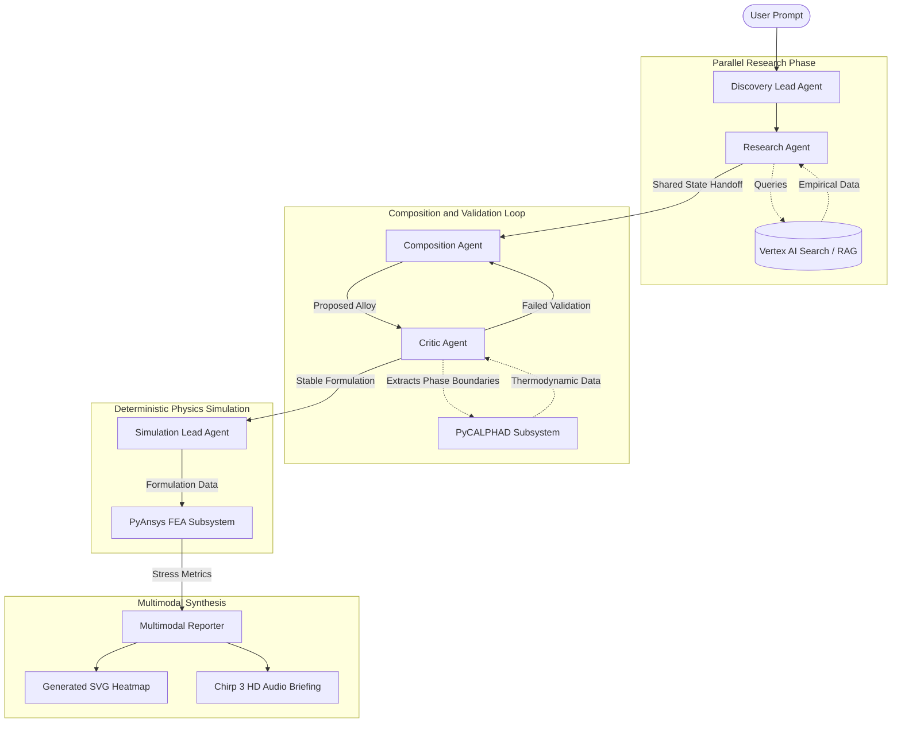

# AeroForge

## Project Objective

AeroForge is an enterprise-grade, autonomous multi-agent system designed to accelerate the discovery and validation of novel aerospace alloys. The traditional paradigm of materials design is manual, labor-intensive, and extremely slow, often taking over a decade to bring a new material to market. AeroForge addresses this bottleneck by automating the entire lifecycle: from complex literature synthesis and formulation to high-fidelity virtual stress testing.

Built upon a Multi-Agent System (MAS) architecture using Google's Agent Development Kit (ADK) and powered by Gemini 3.1 Pro, AeroForge mimics the cognitive process of human materials scientists. It iteratively tests hypotheses, interprets thermodynamic data, and adjusts computational parameters until optimal material outcomes are achieved—dramatically reducing research timelines.

## System Architecture Workflow

AeroForge leverages specialized agents organized in a strict hierarchy to manage the alloy discovery lifecycle deterministically.



### Core Components

1.  **Orchestrator Agents (Coordinator/Dispatcher)**: 
    -   **Discovery Lead**: Analyzes user intent and routes tasks to specialized sub-agents. Runs on a low thinking configuration to minimize latency.
    -   **Simulation Lead**: Manages the handoff from theoretical formulation to digital twin construction.
2.  **Research Agent (Parallel Fan-Out/Gather)**: 
    -   Integrates with Google Cloud Vertex AI Search to establish a Retrieval-Augmented Generation (RAG) framework, ensuring alloy formulations are grounded in verified, up-to-date empirical documentation and patent filings.
3.  **Composition & Critic Agents (Generator and Critic Loop)**: 
    -   **Composition Agent**: Operates on maximum computational depth to generate atomic-scale alloy formulations.
    -   **Critic Agent**: Validates the proposed formulations against thermodynamic stability constraints, iterating with the Composition Agent until a stable matrix is formed.
4.  **Deterministic Physics Simulators**: 
    -   **PyCALPHAD**: Validates thermodynamic modeling and Gibbs energy minimization to ensure stability.
    -   **PyAnsys (Abaqus/Ansys)**: Conducts Finite Element Analysis (FEA) on the digital twin to extract stress metrics under thermal and structural loads.
5.  **Multimodal Presentation Layer**:
    -   Converts dense numerical findings from the physics engines into dynamic SVG heatmaps and synthesizing multi-speaker auditory briefings utilizing Gemini TTS.

## Installation and Setup

### Prerequisites

-   Python 3.10 or higher.
-   Access to Google Cloud Platform (GCP) with Vertex AI and Agent Engine APIs enabled.
-   Installed instances or accessible remote nodes for Ansys and Thermo-Calc databases (if running true physical simulations outside of the internal mock environment).

### Local Environment Setup

1.  Clone the repository and securely navigate to the directory.
2.  Install the core dependencies:
    ```bash
    pip install -r requirements.txt
    ```
3.  Configure the environment variables. Ensure the system is authenticated with your GCP project:
    ```bash
    export GCP_PROJECT_ID="your-project-id"
    export GCP_LOCATION="us-central1"
    export VERTEX_DATA_STORE_ID="your-data-store-id"
    gcloud auth application-default login
    ```

## Usage

To initiate an autonomous discovery session, execute the main entry point pipeline. Pass the required material properties as a natural language prompt.

```bash
python3 -m src.main_workflow "I need a high-temperature lightweight aerospace alloy."
```

### Viewing Simulation Outcomes

Upon completion of the agentic loops and structural validation, AeroForge generates interactive reporting assets inside the `reports/` directory:
-   `heatmap_animation.svg`: A code-generated visual representation of stress distribution and displacement across the component.
-   `executive_briefing.mp3` (or `.txt` in mock mode): An audio readout of the formulation matrix and structural survival status.